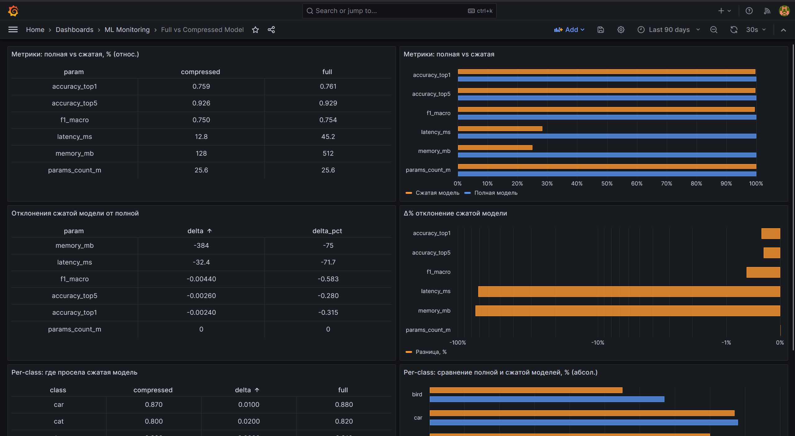

# Gemma Quantization


---

<p align="center">
  
</p>

---

## О проекте

Проект визуализирует сравнение **полной** ML-модели и её **сжатой** (квантизованной) версии. Результаты прогона собираются во внешний файл `comparison.json`, записываются в **InfluxDB** и отображаются в **Grafana** в виде парных панелей «график + таблица». Есть переключатель по метрикам и автоматическое масштабирование каждой панели под свою величину.

### Архитектура

```
┌────────────────────┐
│  comparison.json   │   Результаты прогона (создаётся отдельно, в репо не входит)
└─────────┬──────────┘
          │ читает
          ▼
┌────────────────────┐
│    ingest.py       │   Конфиг подключения берёт из .env
└─────────┬──────────┘
          │ пишет точки (2 measurement'а)
          ▼
┌────────────────────┐
│   InfluxDB 2.7     │   Docker, :8086, bucket: model_comparison
└─────────┬──────────┘
          │ читает через Flux
          ▼
┌────────────────────┐
│    Grafana 10      │   Docker, :3000, дашборд и datasource из provisioning
└────────────────────┘
```

### Стек

- **InfluxDB 2.7** — time-series база данных
- **Grafana 10** — визуализация и дашборды
- **Docker / Docker Compose** — развёртывание сервисов
- **Python 3.8** + `influxdb-client`, `python-dotenv` — инжест данных

---

## Быстрый старт (Quickstart)

### Требования

- [Docker](https://docs.docker.com/get-docker/) и Docker Compose
- Python 3.8+

### Шаги

1. **Склонируйте репозиторий**

   ```bash
   git clone https://github.com/moiz303/LLM_analyse
   cd ./LLM_analyse
   ```


2. **Создайте `.env` из шаблона и заполните значения**

   ```bash
   cp .env.example .env
   ```

   Откройте `.env` и задайте пароли и токен. Набор переменных описан в разделе [Переменные окружения](#переменные-окружения).


3. **Пропишите токен в datasource Grafana**

   В файле `provisioning/datasources/influxdb.yml` найдите поле `token:` и впишите в него **то же значение**, что в `.env` → `INFLUXDB_TOKEN`. В репозитории это поле намеренно оставлено пустым.


4. **Подготовьте `comparison.json`**

   Этот файл **создаётся отдельно** (например, выгружается из прогона модели) и в репозиторий не входит. Формат описан в разделе [Формат `comparison.json`](#формат-comparisonjson). Поместите его в корень проекта.


5. **Поднимите сервисы**

   ```bash
   docker compose up -d
   ```

   При первом запуске InfluxDB автоматически создаст организацию, бакет и токен из `.env`.


6. **Установите Python-зависимости и загрузите данные**

   ```bash
   pip install -r requirements.txt
   python ingest.py comparison.json
   ```

   Ожидаемый вывод: `Записано N точек в InfluxDB (...)`.


7. **Откройте дашборд**

   Перейдите на `http://localhost:3000`. Логин — `GRAFANA_ADMIN_USER` / `GRAFANA_ADMIN_PASSWORD` из `.env` (по умолчанию `admin` / `admin`). Дашборд появляется в папке **ML Monitoring**.

---

## Структура проекта

```
.
├── .env.example                       # шаблон переменных окружения
├── .gitignore
├── docker-compose.yml                 # InfluxDB + Grafana
├── comparison.json                    # входные данные (создаётся отдельно)
├── ingest.py                          # запись JSON в InfluxDB
├── requirements.txt
└── provisioning/
    ├── datasources/
    │   └── influxdb.yml               # подключение InfluxDB → Grafana
    └── dashboards/
        ├── dashboard.yml              # провайдер дашбордов
        └── model_comparison.json      # сам дашборд
```

---

## Формат `comparison.json`

Файл создаётся отдельно и должен соответствовать схеме ниже. `ingest.py` читает поля `metrics` и `per_class` и сам вычисляет производные (`delta`, `delta_pct`).

```json
{
  "$schema": "http://json-schema.org/draft-07/schema#",
  "type": "object",
  "properties": {
    "meta": {
      "type": "object",
      "properties": {
        "full_model": {"type": "string"},
        "compressed_model": {"type": "string"},
        "timestamp": {
          "type": "string",
          "format": "date-time"
        }
      },
      "required": ["full_model", "compressed_model", "timestamp"],
      "additionalProperties": false
    },
    "metrics": {
      "type": "array",
      "items": {
        "type": "object",
        "properties": {
          "param": {"type": "string"},
          "full": {"type": "number"},
          "compressed": {"type": "number"}
        },
        "required": ["param", "full", "compressed"],
        "additionalProperties": false
      },
      "minItems": 1
    },
    "per_class": {
      "type": "array",
      "items": {
        "type": "object",
        "properties": {
          "class": {
            "type": "string"
          },
          "full": {
            "type": "number",
            "minimum": 0,
            "maximum": 1
          },
          "compressed": {
            "type": "number",
            "minimum": 0,
            "maximum": 1
          }
        },
        "required": ["class", "full", "compressed"],
        "additionalProperties": false
      },
      "minItems": 1
    }
  },
  "required": ["meta", "metrics", "per_class"],
  "additionalProperties": false
}
```

| Поле | Тип | Назначение |
|------|-----|------------|
| `meta.full_model` | string | Имя полной модели (тег) |
| `meta.compressed_model` | string | Имя сжатой модели (тег) |
| `meta.timestamp` | string, ISO 8601 | Метка времени точек |
| `metrics[].param` | string | Название метрики (тег, ось X) |
| `metrics[].full` / `.compressed` | number | Значения полной / сжатой модели |
| `per_class[].class` | string | Имя класса (тег, ось X) |
| `per_class[].full` / `.compressed` | number | Значения по классу |

> **Важно про `timestamp`:** значение должно быть валидным ISO 8601 и **не из будущего**, иначе InfluxDB отбросит точки (ошибка `422` / нарушение retention). Формат даты — `ГГГГ-ММ-ДД`, не перепутайте месяц и день.

---

## For Devs

### Как устроен пайплайн

`ingest.py` разбирает `comparison.json` и пишет точки в два measurement'а:

| Measurement | Теги | Поля |
|-------------|------|------|
| `model_metric` | `param`, `full_model`, `compressed_model` | `full`, `compressed`, `delta`, `delta_pct` |
| `per_class_metric` | `class`, `full_model`, `compressed_model` | `full`, `compressed`, `delta` |

Панели дашборда читают их через **Flux**-запросы. Ключевой приём для столбчатых графиков — `pivot(...)`, который превращает «длинный» формат InfluxDB в «широкий» (строка = категория, колонки = `full`/`compressed`), плюс финальный `group()`, чтобы свести всё в один фрейм.

### Переменные окружения

Все переменные живут в `.env` (шаблон — `.env.example`).

| Переменная | Описание | Пример                     |
|------------|----------|----------------------------|
| `INFLUXDB_PORT` | Порт InfluxDB | `8086`                     |
| `INFLUXDB_USERNAME` | Админ InfluxDB | `admin` (по умолчанию)     |
| `INFLUXDB_PASSWORD` | Пароль админа InfluxDB | `<сложный пароль>`         |
| `INFLUXDB_ORG` | Организация InfluxDB | `mlops`                    |
| `INFLUXDB_BUCKET` | Бакет | `model_comparison`         |
| `INFLUXDB_TOKEN` | Токен доступа | `<токен>`                  |
| `INFLUXDB_RETENTION` | Политика хранения | `0` (бессрочно) или `365d` |
| `GRAFANA_PORT` | Порт Grafana | `3000`                     |
| `GRAFANA_ADMIN_USER` | Логин админа Grafana | `admin` (по умолчанию)     |
| `GRAFANA_ADMIN_PASSWORD` | Пароль админа Grafana | `<сложный пароль>`         |

> Токен `INFLUXDB_TOKEN` **дублируется** вручную в `provisioning/datasources/influxdb.yml` (`secureJsonData.token`) — держите их в согласованном состоянии.

### Запуск `ingest.py`

```bash
python ingest.py comparison.json

# с переопределением параметров подключения:
python ingest.py comparison.json --url http://localhost:8086 --org mlops --bucket model_comparison --token <токен>
```

По умолчанию `--url`, `--org`, `--bucket`, `--token` берутся из `.env`.

### Как менять дашборд

Канонический источник — `provisioning/dashboards/model_comparison.json`. Два пути:

1. **Править JSON вручную** — изменить запросы/панели в файле и пересоздать дашборд (см. ниже).
2. **Править в UI и выгружать** — собрать панель в интерфейсе, экспортировать JSON и перезаписать файл. Подробный разбор этого пути — в отдельной инструкции.

Главное правило: **не запрашивать во Flux то, чего в InfluxDB нет** (несуществующие measurement/теги/поля).

После изменения файла пересоздайте дашборд, чтобы Grafana подхватила новую версию:

```bash
docker compose stop grafana
docker volume rm <имя тома>_grafana_data   # имя тома: docker volume ls
docker compose up -d grafana
```

### Добавление новой области данных

Чтобы визуализировать новую сущность (не `metrics`/`per_class`):

1. Добавьте секцию в `comparison.json`.
2. Добавьте цикл в `ingest.py` с **уникальным** именем `Point("<новое_имя>_metric")` и своим тегом-идентификатором.
3. Запустите `python ingest.py comparison.json`.
4. Создайте панель с запросом `filter(... _measurement == "<новое_имя>_metric")`.

Чтобы визуализировать **уже существующие** данные по-новому (другая таблица, другой график) — меняется только панель и её запрос, `ingest.py` трогать не нужно.

---

## Troubleshooting

| Симптом | Вероятная причина | Решение |
|---------|-------------------|---------|
| `422 Unprocessable Entity`, точки не пишутся | `timestamp` вне retention или из будущего | Проверьте дату в `meta.timestamp`; при необходимости увеличьте `INFLUXDB_RETENTION` |
| Дашборд пуст, но данные есть | Неверный временной диапазон на дашборде | Поставьте диапазон, покрывающий `timestamp` точек |
| `unauthorized: unauthorized access` | Токен в `influxdb.yml` не совпадает с `INFLUXDB_TOKEN` | Синхронизируйте значения |
| `Bar chart requires a string or time field` | Запрос без `pivot`/`group` вернул «длинный» формат | Добавьте `pivot(...)` и финальный `group()` |
| В UI InfluxDB «пусто», хотя точки записаны | Вы смотрите метаданные бакета, а не данные | Используйте **Data Explorer** (Script Editor) |
| Grafana игнорирует пароль из `.env` (`admin`/`admin`) | БД Grafana уже инициализирована со старым паролем | Пересоздайте volume `grafana_data` |
| Дашборд не появился после правки файла | Битый JSON или файл не примонтирован | Проверьте `docker compose logs grafana`, валидность JSON и монтирование `./provisioning` |

---

## Лицензия

Created as part of MIEM HSE project activities.

## Ссылки

- Kaggle ноутбук / источник `comparison.json`: https://www.kaggle.com/code/flyin123/gemma-notebook
