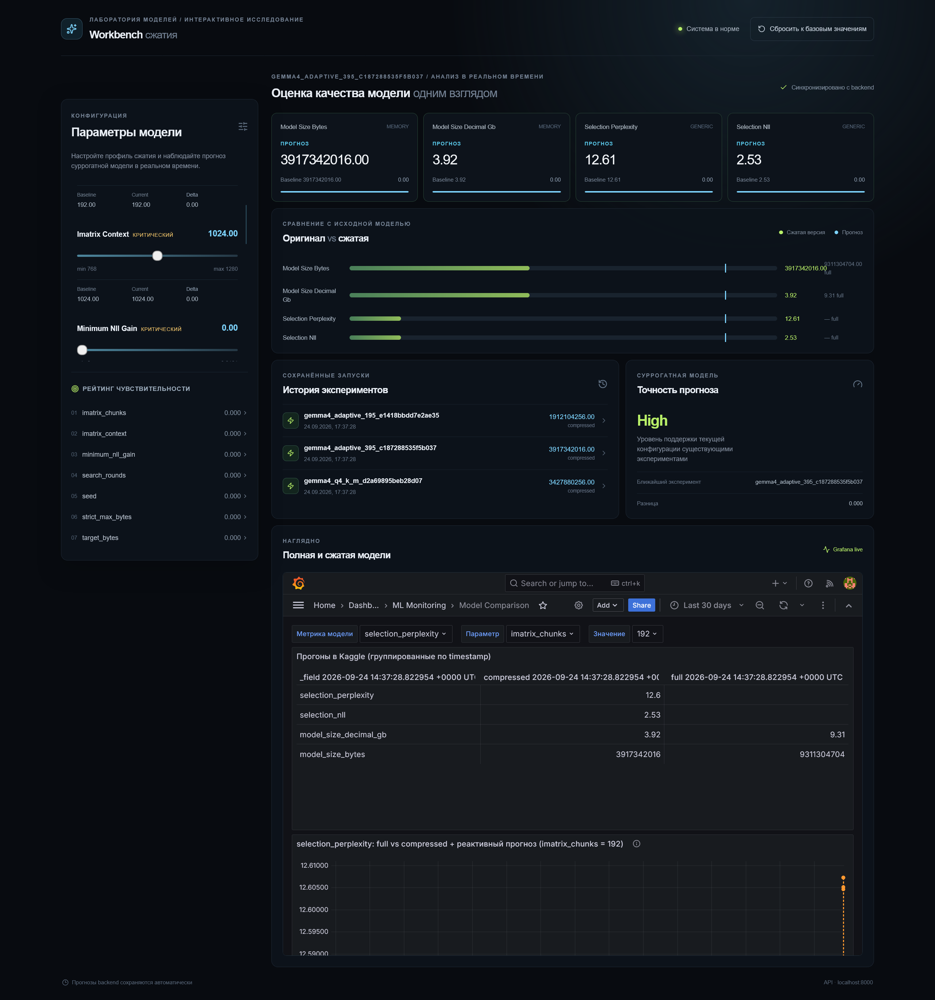

# Интерактивное сравнение сжатия модели


---

<p align="center">
  
</p>


---

## Оглавление

- [О проекте](#о-проекте)
- [Архитектура](#архитектура)
- [Стек](#стек)
- [Быстрый старт](#быстрый-старт)
  - [Frontend без Docker](#frontend-без-docker)
- [Структура проекта](#структура-проекта)
- [Формат входных данных](#формат-comparisonjson)
- [API](#api)
- [InfluxDB и Grafana](#influxdb-и-grafana)
- [Переменные окружения](#переменные-окружения)
- [Для разработчиков](#для-разработчиков)
- [Документация проекта](#документация-проекта)
- [Troubleshooting](#troubleshooting)
- [Лицензия](#лицензия)
- [Ссылки](#ссылки)

---

## О проекте

Проект предназначен для интерактивного сравнения полной ML-модели и её
сжатой версии. Результат исходного чёрного ящика хранится в
`comparison.json`, записывается в InfluxDB и отображается в Grafana.

Тяжёлый эксперимент выполняется отдельно. Backend использует его результат
как baseline, а изменения параметров, выбранные на frontend, обрабатывает
через детерминированный sensitivity-predictor.

Backend предоставляет:

- валидацию конфигурации и экспериментальных данных;
- препроцессинг сырого вывода black box в канонический формат;
- публичную конфигурацию модели для построения slider-интерфейса;
- быстрые предсказания изменения метрик;
- сохранение истории экспериментов;
- раздельную запись actual и predicted данных в InfluxDB;
- готовый dashboard Grafana для сравнения полной, сжатой, предсказанной и
  исторической информации.

Frontend (Next.js + React + Tailwind CSS) предоставляет:

- интерфейс с ползунками параметров, построенный полностью на данных из
  `GET /api/model` (значения диапазонов и метрики не дублируются в коде);
- карточку сравнения «полная модель vs сжатая/prediction» с дельтами и
  цветовой индикацией улучшения/ухудшения;
- историю экспериментов (`GET /api/experiments`) с применением сохранённой
  конфигурации одним кликом;
- индикатор support/точности prediction с предупреждением при экстраполяции;
- встроенный iframe Grafana-dashboard, реактивный к выбранному ползунку
  (`var-param_name` / `var-param_value`) и обновляемый по postMessage после
  каждого `POST /api/predict`;
- кнопку возврата к baseline через `POST /api/reset`.

---

## Архитектура

```text
┌────────────────────────────┐
│ comparison.json            │
│ исходный результат         │
│ прогона в Kaggle           │
└─────────────┬──────────────┘
              │
              ├── автоматический ingest при запуске
              │
              ▼
┌────────────────────────────┐
│ FastAPI backend            │
│ препроцессинг, валидация   │
│ и sensitivity-predictor    │
└───────┬──────────────┬─────┘
        │              │
        │              ├── data/model.json
        │              │   текущий buffer пользователя
        │              │
        │              └── data/experiments/*.json
        │                  история экспериментов
        │
        ▼
┌────────────────────────────┐
│ InfluxDB 2.7               │
│ actual и predicted points  │
└─────────────┬──────────────┘
              │ Flux
              ▼
┌────────────────────────────┐
│ Grafana 11                 │
│ datasource и dashboard     │
└────────────────────────────┘
```

Поток данных с участием Frontend:

```text
Frontend (Next.js) ── GET /api/model ──────> FastAPI   (построение ползунков)
                 ──── POST /api/predict ───> FastAPI ──> InfluxDB
                 ──── iframe + postMessage ────────────> Grafana (визуализация)
```

Frontend обращается к backend через `NEXT_PUBLIC_API_URL` (по умолчанию
`http://localhost:8000`); при локальном запуске без этого env работает rewrite
`/backend/:path* → http://localhost:8000/:path*` из `next.config.mjs`.

### Уровни данных

Проект намеренно разделяет три уровня хранения:

- `comparison.json` — неизменяемый источник истины для baseline и Reset
  (единственный файл данных, который не должен попадать в Git, за исключением уже активного мокового файла);
- `model.json` — текущий buffer параметров пользователя; создаётся backend
  внутри контейнера (копируется из `comparison.json`) при первом запросе;
- `data/experiments/` — snapshots экспериментов; заполняется ingest'ом при
  запуске контейнера.

Файлы `model.json` и содержимое `data/experiments/` — runtime-данные: они
исключены из Git и `.dockerignore`, их не нужно создавать вручную.

При загрузке исходных данных используется fallback-цепочка:

```text
comparison.json
    ↓ если отсутствует
data/model.json
    ↓ если отсутствует
последний файл из data/experiments/*.json
```

`comparison.json` существует всегда, он всегда имеет наивысший приоритет.

### Препроцессинг вывода black box

Black box (Kaggle notebook «GemmaQ5», см. `documentations/blackbox_documentation.md`)
отдаёт результат по формату
`schemas/black_box_experiments_schema.json` (массив `experiments`, объектные
модельные идентификаторы, критические параметры вида `{critical, type, value}`,
отдельные `baseline_values` / `parameter_ranges`). Backend потребляет канонический
формат `schemas/comparison_schema.json`. Между ними лежит препроцессор
`backend/app/services/preprocess_service.py`: при загрузке source of truth и
в `ingest.py` сырой вывод black box автоматически приводится к виду
`comparison.json`, а файлы, уже соответствующие каноническому формату, проходят
без изменений.

Правила выбора эксперимента (`preprocess_raw_payload`):

- `model.json` всегда получает **первый** эксперимент из файла
  (`payload["experiments"][0]`); если он пустой (нет ни метрик, ни параметров),
  берётся самый содержательный запуск;
- остальные запуски архивируются в `data/experiments/` через
  `split_black_box_payload` — каждый под своим `experiment_id`;
- недостающие стороны метрик (full или compressed) восстанавливаются из
  соседних экспериментов того же документа (cross-experiment fallback);
- нечисловые токены (`N/A`, `null` и т.п.) нормализуются в «нет измерения»,
  оригинальный вывод сохраняется в snapshot как `source_experiment`.

Схемы из `schemas/` используются препроцессором и валидацией во время работы
сервера: они копируются в образ (`COPY schemas /app/schemas`) и дополнительно
монтируются в backend-контейнер как `./schemas:/app/schemas:ro` (рядом с
`/app/data`). Путь определяется в рантайме: переменная окружения `SCHEMAS_DIR`
(задаётся в docker-compose), иначе — поиск папки `schemas/` среди родительских
каталогов приложения; при отсутствии возвращается понятная ошибка.

---

## Стек

**Backend и данные:**

- **Python 3.11** — backend и ingestion pipeline;
- **FastAPI** (+ Uvicorn) — HTTP API;
- **Pydantic** — валидация входных данных и конфигурации;
- **influxdb-client** — запись actual/predicted точек в InfluxDB;
- **pytest + httpx** — автоматические тесты backend (`backend/tests`).

**Frontend:**

- **Next.js 16 (App Router) + React 19** — SPA-интерфейс (`frontend/app/page.tsx`);
- **TypeScript 5.7** — типизация контрактов API;
- **Tailwind CSS 4** — стилизация;
- **lucide-react, @base-ui/react, shadcn-утилиты** — UI-примитивы (`components/ui`);
- **pnpm 12** — пакетный менеджер (`pnpm-lock.yaml`, `packageManager` в `package.json`).

**DevOps / визуализация:**

- **Docker / Docker Compose** — единый локальный стек из четырёх сервисов:
  `backend`, `frontend`, `influxdb`, `grafana`;
- **InfluxDB 2.7 (alpine)** — хранение временных рядов;
- **Grafana 11.1** — datasource и dashboard через provisioning
  (`provisioning/`), embedding и анонимный Viewer для iframe с фронтенда.

---

## Быстрый старт

### Требования

- Docker с Docker Compose;
- доступный Docker daemon;
- файл `comparison.json` в корне проекта.

Python и Node.js на хост-системе для обычного запуска не требуются: backend,
ingest и frontend собираются и работают внутри Docker-контейнеров. Для локальной
разработки фронтенда нужны Node.js 20+ и pnpm 12 (см. раздел
[Frontend без Docker](#frontend-без-docker)).

### Шаги

1. Стандартные первые шаги:

   ```bash
   git clone https://github.com/moiz303/LLM_analyse.git
   cp .env.example .env
   ```

2. Заполните `.env`.

   Минимально необходимо задать:

   ```env
   INFLUXDB_PASSWORD=admin
   INFLUXDB_TOKEN=<ваш-токен>
   GRAFANA_ADMIN_PASSWORD=admin
   ```

   Полный список переменных приведён ниже в разделе
   [Переменные окружения](#переменные-окружения).

   **Важно:** Grafana-p datasource (`provisioning/datasources/influxdb.yml`)
   читает токен из поля `secureJsonData.token`, которое сейчас пустое. Без токена
   Grafana не сможет выполнять запросы к InfluxDB, и dashboard останется пустым.
   После получения токена скопируйте его в это поле (или замените значение на
   `${INFLUXDB_TOKEN}`, если ваша версия Grafana поддерживает подстановку env в
   provisioning) и перезапустите Grafana:

   ```bash
   docker compose restart grafana
   ```

   Backend и ingest используют `${INFLUXDB_TOKEN}` из `.env` автоматически — там
   ручное копирование не нужно. Файл `.env` нельзя добавлять в Git.

3. Убедитесь, что `comparison.json` находится в корне проекта. В репозитории
   лежит моковый black-box вывод (`black_box_experiments.v1`) текущего demo —
   препроцессор нормализует его автоматически. Для другого эксперимента
   замените файл валидным JSON канонического формата или сырым выводом
   black box.

4. Запустите весь стек:

   ```bash
   docker compose up -d --build
   ```

   После того как InfluxDB станет healthy, backend автоматически:

   1. прочитает и провалидирует `comparison.json`;
   2. сохранит snapshot в `data/experiments/`;
   3. запишет actual-результаты в InfluxDB;
   4. запустит FastAPI.

   Отдельно выполнять `python backend/ingest.py comparison.json` не нужно, эта команда встроена в запуск backend-контейнера.

5. Проверьте статус контейнеров и автоматической загрузки:

   ```bash
   docker compose ps
   docker compose logs backend
   ```

   В логах backend должна появиться строка вида:

   ```text
   Validated and ingested file-xxx (N metrics)
   ```

### Адреса сервисов

При стандартных значениях из `.env.example`:

- Backend: <http://localhost:8000>
- Health check: <http://localhost:8000/health>
- InfluxDB: <http://localhost:8086>
- Grafana: <http://localhost:3000>
- Dashboard: <http://localhost:3000/d/model-comparison/model-comparison?orgId=1&kiosk>
- Frontend (Next.js): <http://localhost:3100>

Frontend может использовать:

```env
NEXT_PUBLIC_GRAFANA_DASHBOARD_URL=http://localhost:3000/d/model-comparison/model-comparison?orgId=1&kiosk
```

Логин Grafana берётся из `GRAFANA_ADMIN_USER` и
`GRAFANA_ADMIN_PASSWORD`.

### Последующие запуски

Если образы и конфигурация уже собраны:

```bash
docker compose up -d
```

При изменении Dockerfile или кода:

```bash
docker compose up -d --build
```

При необходимости не записи новых данных, а полного пересоздания базы InfluxDB:

```bash
docker compose down -v

docker compose up -d
```

### Frontend без Docker

Для локальной разработки фронтенда (с hot reload) не обязательно пересобирать
Docker-образ. Достаточно запустить backend и инфраструктуру в Docker, а
frontend — локально через pnpm.

Требования: **Node.js 20+** и **pnpm 12.3.4** (закреплён в `packageManager`
файла `frontend/package.json`; удобно ставить через `corepack enable`).

1. Запустите backend, InfluxDB и Grafana:

   ```bash
   docker compose up -d backend influxdb grafana
   ```

2. Установите зависимости и запустите dev-сервер:

   ```bash
   cd frontend
   pnpm install
   pnpm dev
   ```

   Frontend будет доступен на <http://localhost:3000> (dev-порт Next.js; в
   Docker-образе используется `FRONTEND_PORT=3100`).

Как frontend находит backend:

- если задан `NEXT_PUBLIC_API_URL` (по умолчанию в `.env.example` —
  `http://localhost:8000`), браузер обращается к backend напрямую по этому
  адресу;
- если переменная не задана, работает rewrite из `next.config.mjs`:
  `/backend/:path* → ${BACKEND_URL || API_URL || http://localhost:8000}/:path*`.
  В Docker адрес backend передаётся через `BACKEND_URL`
  (= `FRONTEND_BACKEND_URL`, `http://backend:8000`); локально значение по
  умолчанию уже корректно, если backend слушает порт 8000 на хосте.

Адрес Grafana-dashboards для iframe задаётся переменной
`NEXT_PUBLIC_GRAFANA_DASHBOARD_URL` (см. раздел
[Переменные окружения](#переменные-окружения)).

---

## Структура проекта

```text
.
├── .env.example                         # шаблон переменных окружения
├── Dockerfile                           # образ FastAPI backend
├── docker-compose.yml                   # backend + frontend + InfluxDB + Grafana
├── comparison.json                      # source of truth (в Git — моковый black-box вывод текущего demo)
├── requirements.txt                     # зависимости backend (устанавливаются в Dockerfile)
├── backend/
│   ├── app/
│   │   ├── api/                         # HTTP-маршруты (health, model, predict)
│   │   ├── models/                      # Pydantic-контракты
│   │   ├── predictors/                  # base-predictor и sensitivity-модель
│   │   └── services/                    # storage, preprocess, prediction, InfluxDB
│   ├── ingest.py                        # валидация и actual ingest
│   ├── pytest.ini                       # конфигурация тестов (pythonpath)
│   ├── requirements.txt                 # backend + dev-зависимости (pytest, httpx)
│   └── tests/                           # pytest: API, модели, predictor, сервисы
├── frontend/                            # Next.js 16 приложение (отдельный Dockerfile)
│   ├── app/                             # App Router: page.tsx, layout.tsx, globals.css
│   ├── components/
│   │   ├── GrafanaDashboard/            # iframe-обёртка дашборда (postMessage refresh)
│   │   └── ui/                          # shadcn-примитивы
│   ├── lib/                             # утилиты (cn и т.п.)
│   ├── public/                          # иконки и статика
│   ├── Dockerfile                       # multi-stage сборка (node:20-alpine, pnpm)
│   ├── next.config.mjs                  # rewrite /backend/:path* → backend URL
│   ├── package.json                     # pnpm@12.3.4 (packageManager)
│   └── pnpm-lock.yaml, pnpm-workspace.yaml, tsconfig.json, postcss.config.mjs
├── data/
│   └── experiments/                     # runtime-snapshots (пусто в Git, только .gitkeep)
├── documentations/                      # документация проекта (см. «Документацию проекта» ниже)
├── provisioning/
│   ├── datasources/
│   │   └── influxdb.yml                 # datasource Grafana
│   └── dashboards/
│       ├── dashboard.yml                # provider dashboard
│       └── model_comparison.json        # dashboard Grafana
├── schemas/                             # JSON-схемы (монтируются в backend-контейнер)
│   ├── black_box_experiments_schema.json # формат вывода black box (Kaggle)
│   ├── comparison_schema.json           # канонический формат source of truth
│   ├── experiment_schema.json           # snapshot эксперимента
│   └── model_schema.json                # схема model.json
└── src/img/preview.png                  # изображение предпросмотра для README
```

В репозитории из `data/` хранится только каталог `experiments/` с `.gitkeep`.
`model.json` и файлы экспериментов — runtime-данные, которые создаются backend
и ingest внутри Docker-контейнера; вручную их создавать не нужно, и они не
должны использоваться как замена `comparison.json`.

---

## Документация проекта

Подробные документы лежат в `documentations/`:

| Файл                                                                | Содержание                                                  |
|---------------------------------------------------------------------|-------------------------------------------------------------|
| `backend_documentation.md`                                          | архитектура backend, контракты API и DevOps-часть           |
| `frontend_documentation.md`                                         | архитектура frontend и требования UI                        |
| `blackbox_documentation.md`                                         | формат вывода black box Kaggle (`black_box_experiments.v1`) |
| `user-story.md`                                                     | пользовательские сценарии                                   |
| `backend_TASKA.md`, `frontend_TASKA.md`, `blackbox_output_TASKA.md` | постановки задач (TASK A)                                   |

---

## Формат `comparison.json`

Файл должен содержать metadata эксперимента, конфигурацию параметров и хотя
бы одну метрику. Пример:

```json
{
  "experiment_id": "exp_001",
  "meta": {
    "full_model": "gemma_full_fp16",
    "compressed_model": "gemma_nf4",
    "timestamp": "2026-09-15T10:00:00Z",
    "model_id": "gemma_quantization_demo"
  },
  "configuration": {
    "param_a": 0.82,
    "param_b": 0.47,
    "param_c": 1.15
  },
  "critical_parameters": {
    "param_a": {
      "critical": true,
      "baseline": 0.82,
      "min": 0.7,
      "max": 0.9,
      "sensitivity": {
        "accuracy_top1": 0.025,
        "f1_macro": 0.022
      }
    }
  },
  "metrics": [
    {
      "param": "accuracy_top1",
      "full": 0.7613,
      "compressed": 0.7589
    },
    {
      "param": "latency_ms",
      "full": 45.2,
      "compressed": 12.8
    }
  ],
  "per_class": []
}
```

### Основные поля

| Поле                    | Тип      | Назначение                               |
|-------------------------|----------|------------------------------------------|
| `experiment_id`         | string   | Уникальный идентификатор эксперимента    |
| `meta.full_model`       | string   | Имя полной модели                        |
| `meta.compressed_model` | string   | Имя сжатой модели                        |
| `meta.timestamp`        | ISO 8601 | Время actual-точек в InfluxDB            |
| `meta.model_id`         | string   | Идентификатор модели для API и dashboard |
| `configuration`         | object   | Значения параметров в baseline           |
| `critical_parameters`   | object   | Диапазоны и sensitivity параметров       |
| `metrics`               | array    | Значения полной и сжатой модели          |
| `per_class`             | array    | Необязательные метрики по классам        |

Каждый объект в `metrics` содержит:

| Поле         | Тип    | Назначение             |
|--------------|--------|------------------------|
| `param`      | string | Название метрики       |
| `full`       | number | Значение полной модели |
| `compressed` | number | Значение сжатой модели |

Валидация дополнительно проверяет:

- наличие хотя бы одной метрики;
- конечность числовых значений;
- диапазон quality-метрик от `0` до `1`;
- неотрицательность latency и memory;
- непустые имена параметров и моделей;
- корректность timestamp.

`timestamp` должен быть валидным временем ISO 8601, не должен быть временем из
будущего и должен попадать в retention-период InfluxDB.

---

## API

### `GET /health`

Проверка доступности backend:

```json
{
  "status": "ok"
}
```

### `GET /api/model`

Возвращает конфигурацию модели для frontend:

- `model_id`;
- `parameters` — массив параметров (`name`, `baseline`, `ui_range`,
  `valid_range`, `critical`, `sensitivity`);
- `current_configuration` — текущие значения buffer'а;
- `baseline` (конфигурация и compressed-метрики baseline);
- `metrics` — массив метрик (`name`, `full`, `compressed`,
  `absolute_delta`, `relative_delta`, `direction`, `kind`);
- направление оптимизации (`direction`) и тип метрики (`kind`);
- `metadata` (имена моделей, `experiment_id`, `timestamp`);
- `constraints` — описание правил валидации.

Frontend не должен дублировать эти значения в собственном коде.

### `POST /api/predict`

Запрашивает prediction для новой конфигурации параметров:

```json
{
  "parameters": {
    "param_a": 0.76,
    "param_b": 0.47,
    "param_c": 1.15
  }
}
```

Backend:

1. проверяет конфигурацию (все параметры обязательны, неизвестные запрещены,
   значения вне UI-диапазона отклоняются с `422` и текстовым `detail`);
2. рассчитывает метрики через sensitivity-predictor;
3. ограничивает prediction физически допустимыми значениями;
4. вычисляет support относительно ближайшего известного эксперимента;
5. обновляет buffer-файл модели (`model.json`) внутри контейнера;
6. пишет predicted-точки в InfluxDB.

Ответ содержит поля: `prediction_mode`, `model_id`, `prediction`, `baseline`,
`configuration`, `support` (`score`, `level`, `nearest_experiment_id`,
`distance`), `metrics`, `persisted`.

`support` показывает степень экстраполяции и не является вероятностью
правильности prediction.

### `POST /api/reset`

Восстанавливает buffer-файл модели (`model.json`) из исходного
`comparison.json` и возвращает prediction исходной конфигурации в том же
формате, что и `POST /api/predict`. Для baseline compressed-метрики
возвращаются точные измеренные значения.

### `GET /api/experiments`

Возвращает список сохранённых snapshots экспериментов (пустой, пока в
контейнер не выполнен ingest или `POST /api/experiments`).

### `GET /api/experiments/{experiment_id}`

Возвращает полный snapshot эксперимента.

### `POST /api/experiments`

Проверяет и сохраняет новый canonical experiment, а затем записывает его
actual-метрики в InfluxDB.

Документация Swagger/OpenAPI намеренно отключена. Backend предоставляет только
маршруты, необходимые приложению.

---

## InfluxDB и Grafana

### Actual и predicted данные

Результаты исходного black-box эксперимента записываются как:

```text
result_type=actual
prediction_mode=black_box
```

Интерактивные запросы `/api/predict` записываются как:

```text
result_type=predicted
prediction_mode=sensitivity_model
```

Данные не смешиваются: dashboard может отдельно показывать измеренные,
предсказанные и baseline-значения.

### Measurements

Backend пишет все точки в один measurement `metric_results`:

| Тег               | Значения                                    | Назначение                                                  |
|-------------------|---------------------------------------------|-------------------------------------------------------------|
| `model_id`        | из `meta.model_id`                          | идентификатор модели                                        |
| `experiment_id`   | id эксперимента / `interactive` для predict | связь с историей                                            |
| `result_type`     | `actual` / `predicted`                      | разделение измеренного и предсказанного                     |
| `prediction_mode` | `black_box` / `sensitivity_model`           | источник значения                                           |
| `model_type`      | `full` / `compressed` / `predicted`         | какая модель описана точкой                                 |
| `support_level`   | `high` / `medium` / `low`                   | только у predicted-точек                                    |
| `cfg_<param>`     | значение параметра конфигурации             | только у predicted-точек; фильтр реактивной серии в Grafana |

Каждая точка содержит поля — по одному на каждую метрику (`accuracy_top1`,
`latency_ms` и т.д.). Actual-данные пишутся двумя точками (full и compressed)
со временем из `meta.timestamp`; prediction — одной точкой с текущим временем.

> Дашборд `model-comparison` намеренно содержит ровно две панели: таблицу
> экспериментов (группировка по `_time`) и timeseries выбранной метрики, где
> рядом с сериями `full`/`compressed` рисуется реактивная серия `predicted`.
> Панели про support удалены (backend не пишет `model_results`/`support_score`).
> Выбор параметра для реактивной серии приходит из dropdown-переменных
> `param_name` / `param_value` (плюс `metric_choice`); фронт пробрасывает их в
> iframe через `var-param_name=&var-param_value=`, а обновление дашборда идёт по
> событию (postMessage `refresh-dashboard` после каждого /api/predict), поэтому
> автополлинг выключен (`refresh: ""`). Значения `cfg_*` нормализуются до двух
> знаков — ровно как шаг ползунка на фронте.

Grafana и backend подключаются к InfluxDB по внутреннему адресу
`INFLUXDB_URL`, например `http://influxdb:8086`. Браузер использует
host-facing порты из `.env`.

---

## Переменные окружения

Все переменные задаются в `.env`. Шаблон находится в `.env.example`.

### Порты и внутренние адреса

| Переменная                | Назначение                               | Значение по умолчанию  |
|---------------------------|------------------------------------------|------------------------|
| `BACKEND_PORT`            | Порт backend на хосте                    | `8000`                 |
| `INFLUXDB_PORT`           | Порт InfluxDB на хосте                   | `8086`                 |
| `GRAFANA_PORT`            | Порт Grafana на хосте                    | `3000`                 |
| `FRONTEND_PORT`           | Порт frontend на хосте                   | `3100`                 |
| `BACKEND_HOST`            | Адрес прослушивания backend в контейнере | `0.0.0.0`              |
| `BACKEND_CONTAINER_PORT`  | Порт backend внутри контейнера           | `8000`                 |
| `INFLUXDB_URL`            | Внутренний URL InfluxDB                  | `http://influxdb:8086` |
| `INFLUXDB_CONTAINER_PORT` | Порт InfluxDB внутри сети Docker         | `8086`                 |
| `GRAFANA_CONTAINER_PORT`  | Порт Grafana внутри контейнера           | `3000`                 |
| `FRONTEND_CONTAINER_PORT` | Порт frontend внутри контейнера          | `3100`                 |

### Frontend

| Переменная                          | Назначение                                                    | Значение по умолчанию                                                     |
|-------------------------------------|---------------------------------------------------------------|---------------------------------------------------------------------------|
| `FRONTEND_BACKEND_URL`              | URL backend для frontend-контейнера (`BACKEND_URL` в runtime) | `http://backend:8000`                                                     |
| `NEXT_PUBLIC_API_URL`               | Адрес backend, используемый браузером                         | `http://localhost:8000`                                                   |
| `NEXT_PUBLIC_GRAFANA_DASHBOARD_URL` | URL dashboard для iframe (build ARG)                          | `http://localhost:3000/d/model-comparison/model-comparison?orgId=1&kiosk` |

### Backend

| Переменная         | Назначение                         | Значение по умолчанию |
|--------------------|------------------------------------|-----------------------|
| `DATA_DIR`         | Каталог runtime-данных             | `data`                |
| `MODEL_PATH`       | Путь к buffer-файлу модели         | `data/model.json`     |
| `EXPERIMENTS_DIR`  | Директория snapshots экспериментов | `data/experiments`    |
| `SCHEMAS_DIR`      | Директория JSON-схем               | `schemas`             |
| `COMPARISON_PATH`  | Путь к source-of-truth             | `comparison.json`     |
| `FRONTEND_ORIGINS` | Разрешённые frontend origins       | localhost:3100        |

### InfluxDB

| Переменная           | Назначение                          | Значение по умолчанию |
|----------------------|-------------------------------------|-----------------------|
| `INFLUXDB_USERNAME`  | Администратор InfluxDB              | `admin`               |
| `INFLUXDB_PASSWORD`  | Пароль администратора               | `admin`               |
| `INFLUXDB_ORG`       | Организация                         | `mlops`               |
| `INFLUXDB_BUCKET`    | Bucket                              | `model_comparison`    |
| `INFLUXDB_TOKEN`     | Токен доступа                       | задаётся локально     |
| `INFLUXDB_RETENTION` | Retention policy                    | `365d`                |
| `INFLUXDB_REQUIRED`  | Требовать InfluxDB для API-запросов | `false`               |

### Grafana

| Переменная               | Назначение            | Значение по умолчанию |
|--------------------------|-----------------------|-----------------------|
| `GRAFANA_ADMIN_USER`     | Логин администратора  | `admin`               |
| `GRAFANA_ADMIN_PASSWORD` | Пароль администратора | `admin`               |

Значения с паролями и токенами нельзя коммитить в репозиторий.

---

## Для разработчиков

### Запуск тестов

Тесты запускаются из директории `backend` (там лежит `pytest.ini` с
настроенным `pythonpath`):

```bash
cd backend && pytest -q
```

Или из корня репозитория, если PYTHONPATH указывает на `backend`:

```bash
PYTHONPATH=backend pytest -q backend/tests
```

Требуемая версия pytest зафиксирована в `backend/requirements.txt`
(`pytest==8.3.5`). С более новыми версиями pytest (9+) запуск падает еще до
выполнения тестов: `Failed: Marks cannot be applied to fixtures`.

Тесты проверяют:

- валидацию экспериментов;
- обработку отсутствующих и некорректных полей;
- baseline anchoring;
- sensitivity-изменения;
- физические ограничения;
- ошибки API;
- reset;
- сохранение данных через application service boundary.

### Ручной ingest

Обычный запуск выполняет ingest автоматически. Для ручной загрузки файла в
уже работающий контейнер:

```bash
docker compose exec backend \
  python /app/backend/ingest.py /app/comparison.json \
  --url http://influxdb:8086 \
  --org mlops \
  --bucket model_comparison \
  --token '<токен>'
```

Аргументы `--url/--org/--bucket/--token` переопределяют параметры подключения;
без них используются значения из окружения контейнера (`.env`).

Внимание: ingest всегда записывает snapshot эксперимента в директорию
`EXPERIMENTS_DIR` (в контейнере это примонтированный хостовый каталог
`data/experiments/`) и требует настроенного InfluxDB (`required=True`).

### Изменение dashboard

Канонический файл dashboard:

```text
provisioning/dashboards/model_comparison.json
```

После изменения JSON перезапустите Grafana:

```bash
docker compose restart grafana
```

Если Grafana продолжает использовать старую версию dashboard, можно пересоздать
её volume. Это удалит локальное состояние Grafana, поэтому команду следует
использовать осознанно:

```bash
docker compose down
docker volume ls
docker volume rm <имя_тома_grafana_data>
docker compose up -d
```

---

## Troubleshooting

| Симптом                                | Возможная причина                                          | Что проверить                                               |
|----------------------------------------|------------------------------------------------------------|-------------------------------------------------------------|
| В InfluxDB нет данных после запуска    | Не стартовал automatic ingest                              | `docker compose logs backend`                               |
| Backend не запускается                 | InfluxDB ещё не healthy или неверный токен                 | `docker compose ps`, `docker compose logs influxdb backend` |
| `unauthorized`                         | Токен в существующем InfluxDB volume не совпадает с `.env` | Проверьте token или пересоздайте volume                     |
| Ошибка `422` при ingest                | Timestamp из будущего или вне retention                    | Проверьте `meta.timestamp` и `INFLUXDB_RETENTION`           |
| Grafana открывается, но dashboard пуст | Неверный временной диапазон                                | Выберите диапазон, покрывающий timestamp точек              |
| InfluxDB UI показывает пусто           | Открыты не данные bucket, а другая секция интерфейса       | Используйте Data Explorer                                   |
| Grafana не показывает dashboard        | Ошибка JSON или provisioning                               | `docker compose logs grafana` и проверка JSON               |
| Grafana игнорирует новый пароль        | Grafana уже инициализирована старым volume                 | Пересоздайте `grafana_data`                                 |

Если credentials изменились после первого запуска, помните: InfluxDB и Grafana
сохраняют первоначальную инициализацию в Docker volumes. Для полного сброса
используйте следующую команду только если удаление локальных данных допустимо:

```bash
docker compose down -v
docker compose up -d --build
```

---

## Лицензия

Проект создан в рамках проектной работы MIEM HSE.

## Ссылки

- Исходный notebook и источник экспериментальных данных:
  <https://www.kaggle.com/code/flyin123/gemmaq5>
